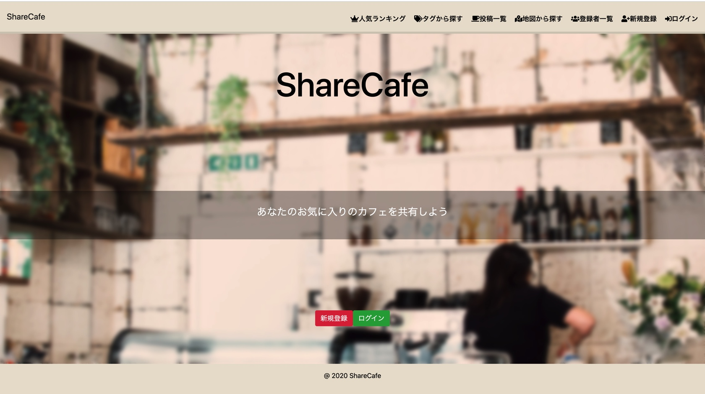

# アプリの概要

ShareCafe

* お気に入りのカフェを共有するアプリになっています！

## URL
https://sharecafe.herokuapp.com/

* トップページ右上のログインボタンか中央にあるログインボタンを押し、画面遷移後ゲストユーザーログインボタンを押すとログインすることができます。

## 制作背景
* 日常生活の中で、カフェに行きたいなと思った時にインスタグラムなどで探したりするのですが、検索しても行きたいカフェが見つけづらかったりするので,そこで、地図から探す機能だったり、人気があるカフェを見つけやすくする機能を搭載して行きたいカフェを探すことができるアプリを制作しました。

## 機能一覧
* ユーザー登録・ログイン機能(devise) 
* 簡単ログイン機能 
* マイページ機能 (ユーザーの投稿一覧,ユーザーのいいね一覧,アカウント編集） 
* カフェの投稿・編集・削除・一覧表示機能 
* 画像アップロード機能(carrierwave, rmagick) 
* 星評価機能 
* 住所を入力でGoogle Maps 地図表示機能 (Maps JavaScript API,Geocoding API) 
* タグ付け機能 
* 検索機能 (ransack) 
* GoogleMapから投稿されたカフェを探す機能 
* 人気ランキング(いいねが多い上位5つの投稿を表示） 
* ハッシュタグから探す機能 
* 登録者一覧 
* いいね機能（Ajax） 
* コメント機能（Ajax) 
* ページネーション機能(kaminari) 
* Rspec / Rubocop テスト機能 
* モデルの単体テスト

## 使用技術一覧
* ruby 2.6.3 
* rails 5.2.4.4 
* HTML 
* scss 
* Bootstrap 
* JavaScript 
* JQuery 
* Ajax 
* MySQL 
* Rubocop 
* RSpec 
* AWS (VPC,EC2,RDS,Route 53,ALB)
## その他
* VSCode 

